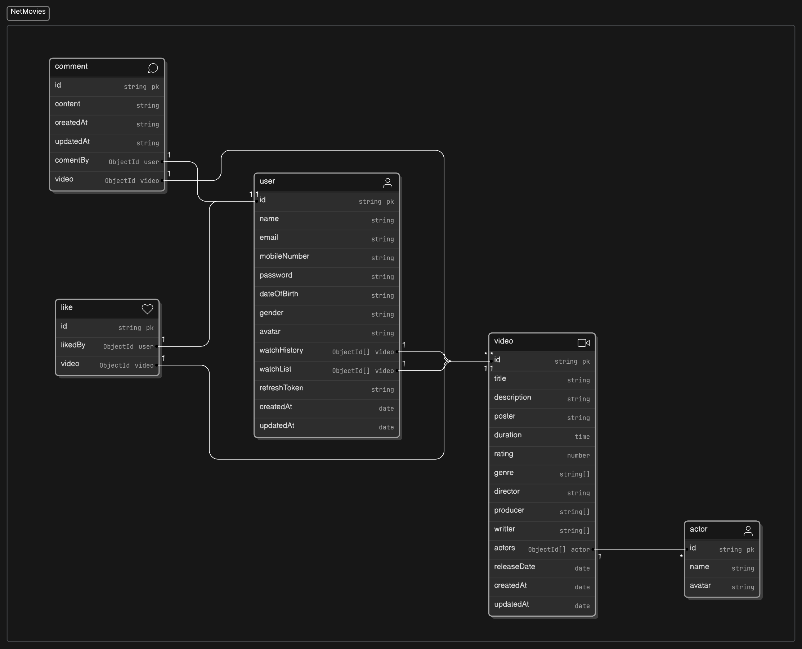
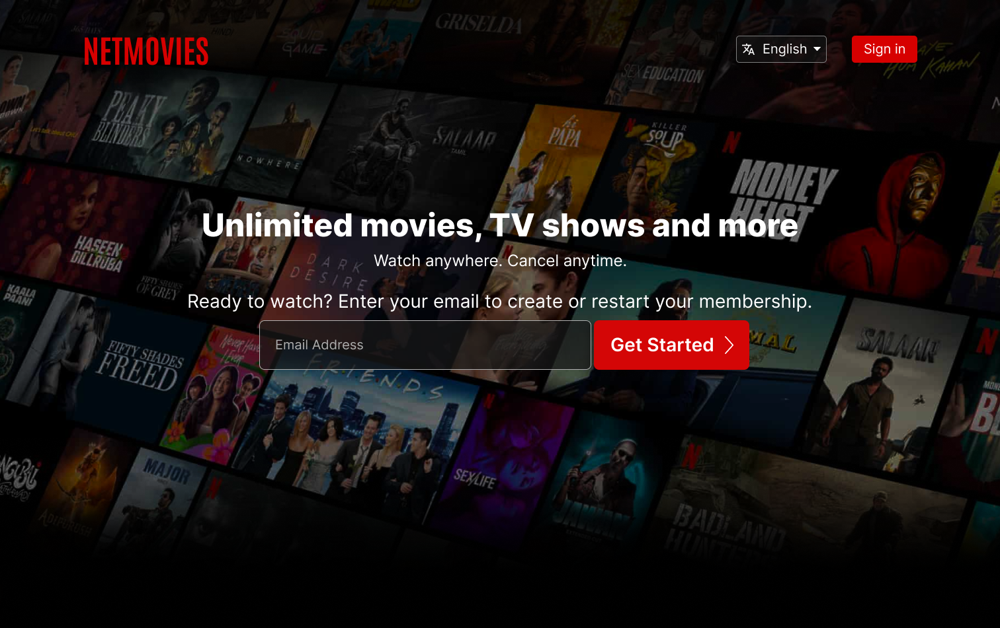
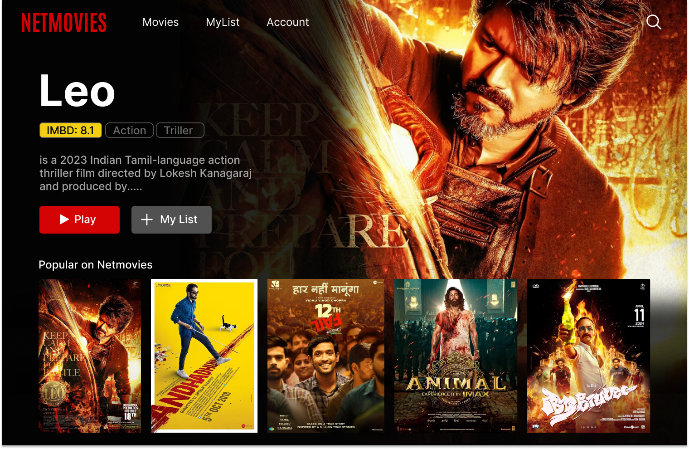
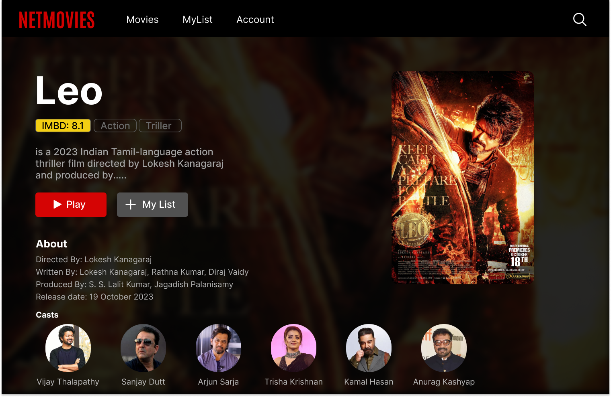
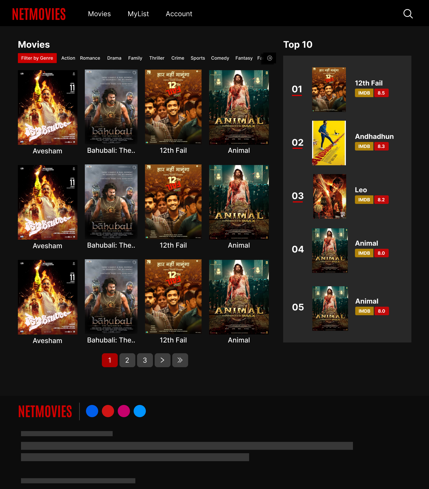

# NetMovies 
A fully Netflix clone website.
- `Last edited: 20 May 2024`.

## Functionalities:
+ User Authorization & Authentication
+ REST full APIs for movies, comments
+ Filters (e.g. based on genre etc.)
+ Search Recomendation
+ MyList, History of movies for User


## Tools & Technologies:
1. React, React-Router-Dom
2. Tailwind CSS
3. Express.js
4. MongoDB, Mongoose
5. AWS S3/Cloudinary
6. VS Code
7. Postman
8. Eraser
9. Figma
10. Chat GPT

## To Setup Project:
### Client Side:
```bash
    npm install
    #to run
    npm run dev
```
### Server Side
```bash
    npm install
    #Configure .env file
```


## Schema Model:



## Figma Designs
1. Landing Page


2. Home Page


3. Movie Details


4. Movies List

